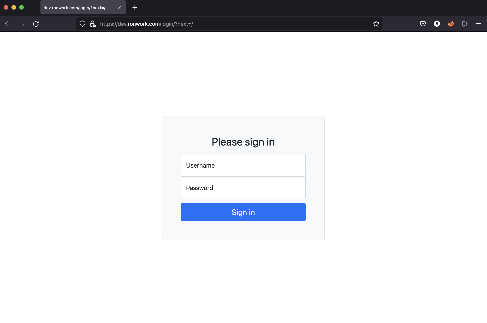
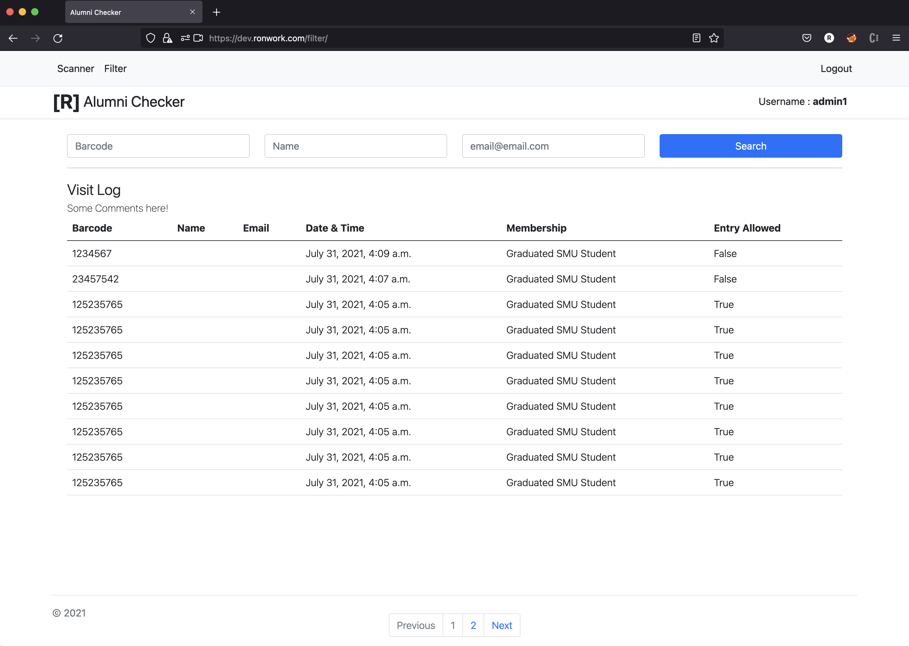

# Alumni Checker
This tool will query SMU alumnus status from [ALMA](https://exlibrisgroup.com/products/alma-library-services-platform/) through Alma REST API. The ID barcode can either be scanned or manually inputed. Powered by [Django](https://www.djangoproject.com/) Python web framweork and [PostGres](https://www.postgresql.org/) and containerized in [Docker](https://www.docker.com/), with [Nginx](https://www.nginx.com/) as reverse proxy with HTTPS enabled.


# Features
* ## Login
   * There are there are three default users ```admin``` (for Django Admin), ```admin1``` and ```user1```. All passwords are ```password```.
  * And two user groups ```userGroup``` and ```adminGroup```.

      
 
* ## How to Use:
    | Scan Operation      | Non-Members During peak hours  |
    | ----------- | ----------- |
    | <center></center>    | <center></center>        |
    | Scan the barcode and it will be recirected<br>  automatically. another option is to type it <br>in the textfield and tap in submit.   | The result will then be shown on the next <br>page togethern with the last ten login <br>records of the visitor       |

* ## Admin View
    

# Installation Notes:
1. Install [docker](https://docs.docker.com/get-docker/). 
   
2. Clone this repository
    ```bash
    $ git clone https://github.com/RonBulaon/AlumniChecker.git
    $ cd AlumniChecker
    ```

3. For development  use the command beloww. It will use SQLite3 instead of Postgres, and without reverse proxy. Then access is on your browser ```http://localhost:8000```.
   ```bash
   docker-compose -f docker-compose.yml up --build 
   ```

4. For pre-deployment testing use this command. This will utilize the Postgres and reverse proxy. This will be accessible from your browser on ```https://localhost```.
    ```bash
    $ docker-compose -f docker-compose-prod.yml up --build 
    ```

5. Do not forget to change the certificates. Command below for generating self signed certificate using openssl.
   ```bash
   openssl req -x509 -sha256 -nodes -days 365 -newkey rsa:4096 -keyout private.key -out certificates.crt
   ```
6. Django related settings:
   * In ```settings.py```
     * Update the ```SECRET_KEY```
     * Update the ```TIME_ZONE``` if you are not in Singapore
   * Update the ```ALLOWED_HOSTS``` list in ```docker-compose-prod.yml```

7. In Django Admin Panel
    * Add in your [ALMA API](https://developers.exlibrisgroup.com/alma/apis/) with out it all entried will be considered non-member.
    * Pagination default is 100 you can change it here too.
    * No peak hours has been set by default. Put in the hour in military format in the database.


# Credits
The **html5-qrcode** barcode scanner used is from [mebjaz](https://github.com/mebjas) from this [repository](https://github.com/mebjas/html5-qrcode).


# License 
Copyright 2021 **Ron Bulaon**
